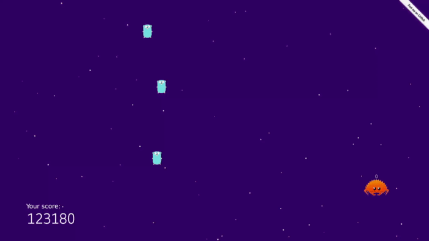

This project is a rust implementation of the Winterbells game by Ferry Halim. [(play the original in 3rd party archive)](http://www.freewebarcade.com/html5/flash/winterbells.html)

## Asset attributions

* Gopher: Renee French - CC-BY 3.0
* Ferris the Rustacean:  Karen Rustad Tölva - CC0 (Public domain)
* touch screen icon: Andrew Nielsen from the Noun Project - CC-BY 3.0
* Bike, Bell Ding, Single, 01-01.wav: InspectorJ (freesound.org) - CC-BY 3.0

## TODO

It's not clear what `EcCtx` vs `WorldManager` does. Some global resources are stored in the EC world (e.g. `DrawingCtx` or `PointerState`) but some are not (e.g. `GraphicsCtx` or `SocketContext`). Ideally everything should be managed by EC. This isn't really different than the current global variable approach anyway, but make things more modular and the code easier to read. Things like `ShaderProgram` or textures can also be resources, with loading done by the `Default` implementation, so drawing system can just e.g. `Read<SomeTexture>`.

`server/main.rs` is simply too messy. Should also get rid of the unsafe code.

Put all system/component/resources in one place, while registering different dispatches for client and server.

Functions that do things like create entities, etc. should never take `&mut World`, and should instead take a set of storages.
